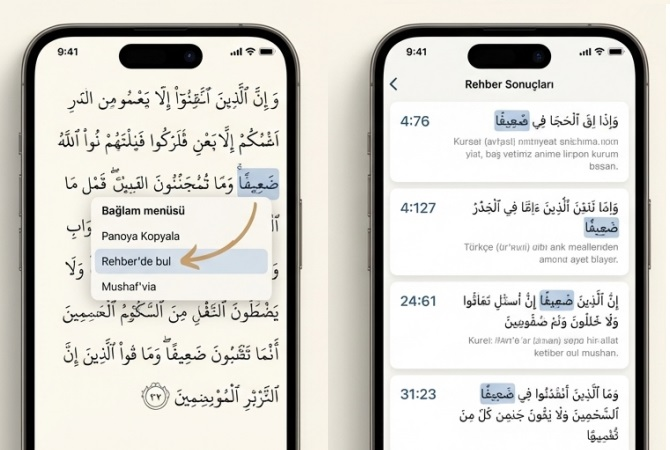

## Yapay Zeka ve Iqra

İlk LLM modellerinin yaygınlaşmasından bu yana (neredeyse üç yıl oldu) Yapay Zekâ ürünlerini uzaktan takip ediyor ve aktif olarak kullanıyorum; Mail yazarken, sunum hazırlarken ve yazılım geliştirirken ChatGPT başta olmak üzere YZ araçlarından çok faydalandım.

Bu süreçte edindiğim genel intiba şöyle: YZ’den çıkan hiçbir ürün doğrudan, olduğu gibi kullanılabilir olmuyor. İlk bakışta çok etkileyici ve büyük ölçüde doğru görünüyor; ancak gerçekten işe yarar hâle gelmesi için ciddi bir müdahale ve düzeltme gerekiyor.

Okuyun5 mail grubumuzun faal üyelerinden, YZ kullanımında deneyimli olan C Penbe, Iqra Türkçe yardım dosyasını NotebookLM ile işleyerek 3 adet dosya paylaştı. (18/12/2025)

### 1. Tanıtım videosu

Bunlar arasında beni en çok düşündüren çalışma bir tanıtım videosu oldu:  
[https://youtu.be/K2HzA97kD4Q](https://youtu.be/K2HzA97kD4Q)

Videoyu ilk izlediğimde çok etkilendim, hatta hemen kullanmayı bile düşündüm. Ancak dikkatli izleyince bariz hatalar ve ton problemleri göze çarpıyor. Özellikle pazarlamacı dili çok baskın. Doğrudan kullanmaya hazır değil, bunu temel alıp daha iyisini yapmak gerekiyor.

### 2. Tanıtım sunumu

Sırada bir Tanıtım sunumu var, uzunca olduğu için buluta yükledim:  
[Iqra_Kuran_yolculugu.pdf](https://okuyun.github.io/YZ/iqra/Iqra_Kuran_yolculugu.pdf)

Yine aynı sorunlar: Sunum çok hızlı üretiliyor ve ilk bakışta muhteşem görünüyor, lakin içerik tamamen yanlış.

Ne Iqra soldaki gibi görünüyor, ne de Rehber sağdaki gibi. Üstelik gösterilen metinler ve menüler hepten yanlış! Sadece seçilmiş **da'îfen** kelimesi doğru. Video için verdiğim hüküm bunun için de geçerli: Doğrudan kullanıma hazır değil, bunu temel alıp daha iyisini yapmak gerekiyor.

### 3. Sanal [münazara](https://lugatim.com/s/münazara) (Debate)

Bu daha çarpıcı bir parça: İki sanal kişi, Iqra yazılımı hakkında fikir tartışması yapıyor: Iqra ve benzeri yazılımlar geleneğin yanında mı yoksa karşısında mı?  

<audio controls src="./Iqra_munazara.m4a" title=münazara></audio>  
Tartışma kesin bir sonuca ulaşmıyor, iki görüşün de ağır bastığı noktalar var.  

### Yazılıma etkisi

Yapay Zekanın hakkını verelim: Bir ay öncesinde yardım dosyalarının çevirisini de YZ yardımıyla yapmıştık. Şimdi video ile sunumun akış planı ve görünümü harika, bunları da aynen kullandım:
* [İngilizce yardım](https://okuyun.github.io/Kuran/guideQ.EN)
* [Sunum burada](https://okuyun.github.io/YZ/iqra/Iqra_sunum.pdf)
* Video:
<iframe src="https://youtube.com/embed/ycCW-oSijbs" frameborder="0" allow="accelerometer; autoplay; clipboard-write; encrypted-media; gyroscope; picture-in-picture" allowfullscreen></iframe>

